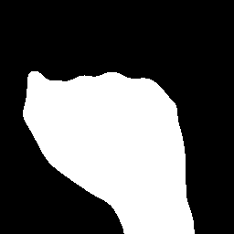
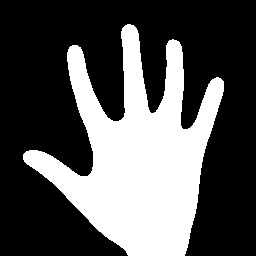
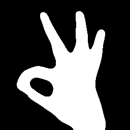
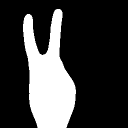
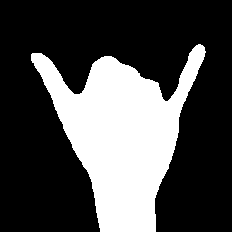
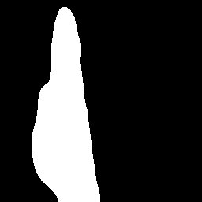
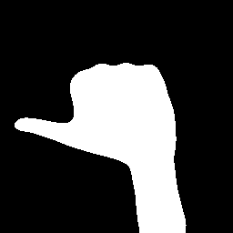
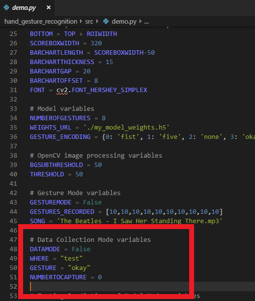
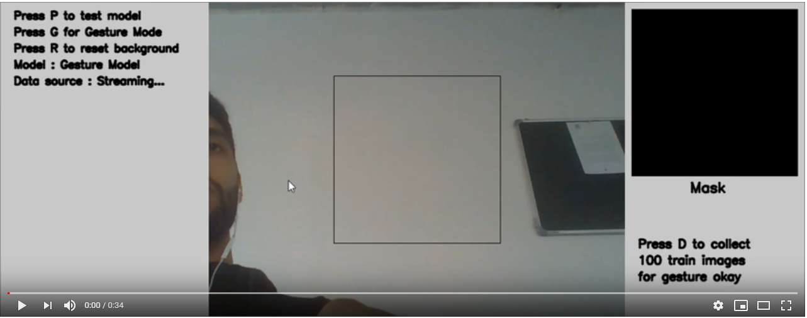

# Gesture Jester
## Description
This repository contains the Python code to develop your own hand gesture recognition system. 

The app consists of 3 different modes:
1. __**Data Collection Mode:**__ Allows the user to collect train, test, or validation data on a variety of hand gestures
2. __**Model Testing Mode:**__ Test the model's ability to discern between different gestures through real-time visualizations
3. __**Music-Player/Gesture Mode:**__ Use gestures to play music, pause music, and change the volume of music

I presented this app as my final project for a coding bootcamp I attended. The slide deck for my presentation has been included in the repository.

## Packages Used
- OpenCV 
- Keras
- PyGame
- NumPy

## Files
Here's a list of files in the directory:
- `src/demo.py`: Contains all the functions to start and run the app
- `src/music`: Contains the song that will be played during 'gesture mode'
- `Presentation (Gesture Jester)`: Contains the slide deck for my project presentation

## Usage
In order to start the application, do the following:
1) Clone the repo
```
git clone https://github.com/mdylan2/gesture_jester.git
```
2) Navigate into the folder, set up a virtual environment and activate it
3) Once you've activated the virtual environment, install the requirements
```
pip install -r requirements.txt
```
4) Download `my_model_weights.h5` from [this Kaggle link](https://www.kaggle.com/dylanmendonca/training-hand-gesture-model) and store the file in the src folder. The model was trained on data 
that I collected through the 'data collection mode' of the app. If you find that my trained model doesn't work well for you or you feel like you need more gestures,
you can train the model using images of your own hand. Please refer to the Kaggle link for more information on building or training the model.
5) Navigate into the src folder and run the following command:
```
python demo.py
```
6) Some of the features have been included in the snippets in the Application Interface section

## Gesture Recognition Model
The model was built to recognize 7 different hand gestures and the absence of a hand. The encoding of the gestures is included in the demo file under the variable `GESTURE_ENCODINGS`. 
List of gestures recognized (in the order of the encodings):
1. `Fist`</br>

2. `Five`</br>

3. `None`</br>

4. `Okay`</br>

5. `Peace`</br>

6. `Rad`</br>

7. `Straight`</br>

8. `Thumbs`</br>


## Music Player Model (Gesture Mode)
Currently the system is set up to recognize 6 gestures:
1. `Rad`: Loads the song (I Saw Her Standing There)
2. `Fist`: Plays/unpauses the song
3. `Five`: Pauses the song
4. `Okay`: Increases the volume. Hold the pose to continue increasing the volume
5. `Peace`: Decreases the volume. Hold the pose to continue decreasing the volume
6. `Straight`: Stops the song
7. `None`: Does nothing

## Application Interface
### `Capture Background`


### `Data Collection Mode`



### `Testing Model Mode`


### `Gesture Mode (Music Player)`[Click the Image below!]
[](https://vimeo.com/351121225)
>  **Note: Video is actually on Vimeo. Blame YouTube and its copyright issues**

## Questions/Contributions/Future Work
- I have tried to include as much instruction for use on the app GUI. Please let me know if you have any further questions.
- I didn't put much focus into the Music Player (was more of a proof of concept) so there might be a lot of bugs in there. I'm hoping to continue building GUI features around the music player so the user can see the volume, current song, etc.
- Last but not least, I'm very open to any recommendations or contributions! Please reach out to me on Github if you would like to chat.
